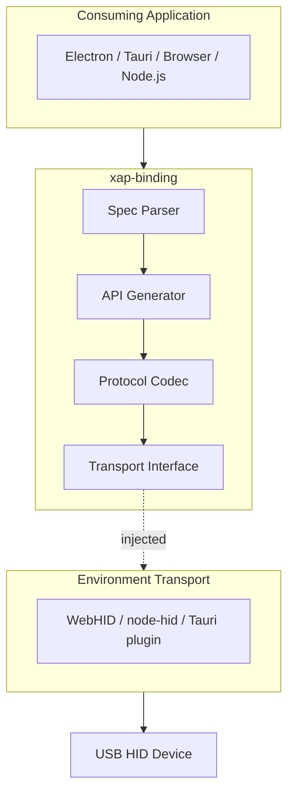
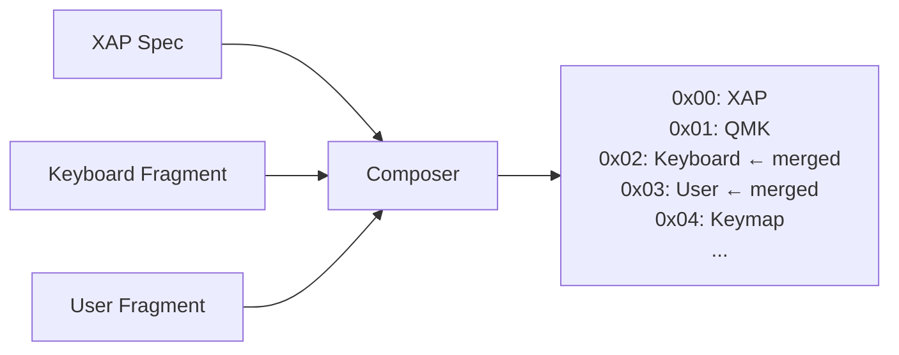

# XAP Binding Library Specification

## Overview

A TypeScript library that generates RPC-style bindings from QMK XAP protocol specifications. It translates user-facing API calls into byte buffers and parses responses. Transport is provided by the consuming environment.

## Architecture



### Core Principles

1. **No transport implementation** — Library is a pure protocol codec
2. **Runtime spec loading** — Specs can be imported statically or fetched dynamically
3. **Extensible** — Keyboard and user fragments inject custom routes

## Module Format

**ESM only.** All target environments support ES modules natively.

```json
{
  "type": "module",
  "exports": {
    ".": "./dist/index.js",
    "./versions/*": "./versions/*"
  }
}
```

## Language

**TypeScript** with the following approach:

- Core library written in TypeScript
- Spec JSON schema is fully typed (`XapSpec`, `Route`, `Command`, etc.)
- Generated API uses indexed types (exact shape determined at runtime)

```typescript
interface XapClient {
  // Nested command namespaces (generated from spec)
  [subsystem: string]: {
    [command: string]: (payload?: unknown) => Promise<unknown>;
    [hasCommand: `has${string}`]: () => boolean;  // Capability checks
  };

  // Event handling
  on(event: string, handler: (...args: unknown[]) => void): void;
  off(event: string, handler: (...args: unknown[]) => void): void;
}
```

Optional: Consumers with static spec imports can use generic overload for type inference.

## Transport Interface

Push-based interface injected at construction:

```typescript
interface XapTransport {
  /**
   * Send a HID report to the device.
   * Buffer contains complete packet: token + length + route + payload.
   */
  write(buffer: Uint8Array): Promise<void>;

  /**
   * Register handler for incoming HID reports.
   * Transport calls handler for both responses and broadcasts.
   */
  onData(handler: (buffer: Uint8Array) => void): void;

  /**
   * Close the transport connection.
   */
  close?(): Promise<void>;
}
```

## API Design

### Factory Function

```typescript
function createXapClient(
  spec: XapSpec,
  transport: XapTransport,
  options?: {
    keyboard?: RouteFragment;  // Injects into subsystem 0x02
    user?: RouteFragment;      // Injects into subsystem 0x03
    timeout?: number;          // Default request timeout (ms)
  }
): XapClient;
```

### Nested Namespace

API mirrors the spec's hierarchical structure:

```typescript
xap.xap.versionQuery()
xap.qmk.boardIdentifiers()
xap.lighting.backlight.getConfig()
xap.keyboard.customCommand()  // From fragment
```

### Method Signatures

Commands accept optional payload and options:

```typescript
// No payload
await xap.xap.versionQuery();

// With payload
await xap.qmk.configBlobChunk(offset);

// With struct payload
await xap.keymap.getKeycode({ layer: 0, row: 1, column: 2 });

// With options
await xap.qmk.someCommand(payload, {
  fireAndForget: true,  // Use token 0xFFFE, don't wait for response
  timeout: 5000         // Override default timeout
});
```

## Protocol Implementation

### Packet Structure

**Request:**
```
| Token (u16 LE) | Length (u8) | Route (u8[]) | Payload (u8[]) |
```

**Response:**
```
| Token (u16 LE) | Flags (u8) | Length (u8) | Payload (u8[]) |
```

**Broadcast:**
```
| 0xFFFF (u16 LE) | Type (u8) | Length (u8) | Payload (u8[]) |
```

### Token Management

- Library generates random tokens per request (range `0x0100`–`0xFFFD`)
- Tracks pending requests by token for response correlation
- Reserved: `0xFFFE` (fire-and-forget), `0xFFFF` (broadcast)

### Type Codec

| Spec Type | Wire Format | JavaScript Type |
|-----------|-------------|-----------------|
| `u8` | 1 byte | `number` |
| `u16` | 2 bytes LE | `number` |
| `u32` | 4 bytes LE | `number` |
| `u64` | 8 bytes LE | `bigint` |
| `bool` | 1 byte | `boolean` |
| `u8[n]` | n bytes | `Uint8Array` |
| `string` | UTF-8 encoded | `string` |
| `struct` | packed members | `{ memberName: value }` |

### Special Return Purposes

| `return_purpose` | Decoding |
|------------------|----------|
| `bcd-version` | `{ major: number, minor: number, patch: number }` |
| `capabilities` | Raw `number` (bitfield) |

### Struct Member Naming

Spec names like `"Vendor ID"` convert to camelCase: `vendorId`.

## Constants

### Exported

```typescript
export const SecureStatus = {
  Disabled: 0,
  Unlocking: 1,
  Unlocked: 2,
} as const;
```

Used when handling secure route flow (see [Secure Routes](#secure-routes)).

### Internal

The following are derived from the spec or protocol documentation and remain internal:

- **Response flags** — Parsed from `response_flags.bits`, used to interpret responses
- **Subsystem IDs** — From `routes` keys, used to construct route bytes
- **Broadcast type IDs** — From `broadcast_messages`, used to dispatch events
- **Token ranges** — Used for generation and identifying broadcasts/fire-and-forget

Consumers interact via the typed API, not raw protocol values.

## Async Model

### Commands

Return Promises that resolve with parsed response:

```typescript
const version = await xap.xap.versionQuery();
// { major: 0, minor: 3, patch: 0 }

const board = await xap.qmk.boardIdentifiers();
// { vendorId: 0x1234, productId: 0x5678, productVersion: 1, qmkUniqueIdentifier: ... }
```

### Broadcasts

Emit events via EventEmitter pattern:

```typescript
xap.on('log', (message: string) => { });
xap.on('secureStatus', (status: number) => { });
xap.on('keyboardBroadcast', (id: number, payload: Uint8Array) => { });
xap.on('userBroadcast', (id: number, payload: Uint8Array) => { });
```

## Error Handling

Errors reject Promises with typed Error subclasses:

```typescript
class XapError extends Error { }

class XapResponseError extends XapError {
  flags: number;
}

class XapSecureError extends XapError { }

class XapTimeoutError extends XapError { }

class XapUnsupportedError extends XapError {
  subsystem: string;
  command: string;
}
```

Usage:

```typescript
try {
  await xap.qmk.bootloaderJump();
} catch (e) {
  if (e instanceof XapUnsupportedError) {
    // Command not supported by device
  } else if (e instanceof XapSecureError) {
    // Unlock required
  } else if (e instanceof XapTimeoutError) {
    // Device not responding
  }
}
```

## Secure Routes

Caller explicitly manages unlock flow:

```typescript
import { SecureStatus } from 'xap-binding';

// Check status
const status = await xap.xap.secureStatus();

// Initiate unlock if needed
if (status !== SecureStatus.Unlocked) {
  await xap.xap.secureUnlock();
}

// Wait for broadcast
xap.on('secureStatus', (newStatus) => {
  if (newStatus === SecureStatus.Unlocked) {
    // Now safe to call secure routes
  }
});

// Call secure route (throws XapSecureError if not unlocked)
await xap.qmk.bootloaderJump();
```

## Specification Composition

### Fragment Structure

Fragments inject routes into reserved subsystems:

```typescript
interface RouteFragment {
  routes: Record<string, Route>;
}
```

### Example Fragment

```json
{
  "routes": {
    "0x00": {
      "type": "command",
      "name": "Custom LED Control",
      "define": "LED_CONTROL",
      "request_type": "u8",
      "return_type": "u8"
    }
  }
}
```

### Merging



### Fragment Validation

No schema validation is performed on fragments. If a fragment cannot be parsed during API generation, an exception is thrown. Consumer is responsible for providing well-formed fragments.

## Version Handling

### Backwards Compatibility

The XAP protocol guarantees version compatibility:

- **Routes are never reordered or reassigned** — Route IDs are stable across versions
- **Newer specs work with older devices** — A 0.3.0 spec works with a 0.1.0 device; capabilities return `0` for unsupported routes
- **Older specs work with newer devices** — A 0.1.0 spec works with a 0.3.0 device; newer device features simply aren't exposed

This means any spec version works with any device version. The capabilities query is the source of truth for what the connected device supports.

### Capability Checking

The library handles capability checking internally:

```typescript
// Calling an unsupported command throws XapUnsupportedError
try {
  await xap.qmk.bootloaderJump();
} catch (e) {
  if (e instanceof XapUnsupportedError) {
    console.log('Device does not support bootloader jump');
  }
}

// Check support before calling (avoids exception)
if (xap.qmk.hasBootloaderJump()) {
  await xap.qmk.bootloaderJump();
}

// Query raw capabilities if needed
const capabilities = await xap.qmk.capabilitiesQuery();
```

Each command has a corresponding `has*()` method that performs the bitwise capability check internally. Capabilities are queried lazily and cached.

### Recommended Usage

```typescript
import spec from 'xap-binding/versions/xap_0.3.0.json';
const xap = createXapClient(spec, transport);

// Just call commands - library throws if unsupported
const version = await xap.xap.versionQuery();
const board = await xap.qmk.boardIdentifiers();
```

### Dynamic Spec Loading

For forward compatibility with future protocol versions:

```typescript
// Fetch newer spec if available
const spec = await fetch('/specs/xap_0.4.0.json').then(r => r.json());
const xap = createXapClient(spec, transport);
```

Library ships all known spec versions in `versions/` directory.

## Project Structure

```
xap-binding/
├── src/
│   ├── index.ts              # Public exports
│   ├── client.ts             # createXapClient factory
│   ├── types.ts              # TypeScript interfaces
│   ├── constants.ts          # Protocol constants (exported: SecureStatus; internal: Token)
│   ├── errors.ts             # Error classes
│   ├── emitter.ts            # Minimal event emitter (zero dependencies)
│   ├── core/
│   │   ├── buffer.ts         # Binary encoding/decoding (LE)
│   │   ├── token.ts          # Token generation and tracking
│   │   ├── codec.ts          # Type system codec
│   │   └── protocol.ts       # Packet construction/parsing
│   └── generator/
│       └── api.ts            # Generates namespace from spec
├── versions/                 # XAP spec JSON files
│   ├── xap_0.0.1.json
│   ├── xap_0.1.0.json
│   ├── xap_0.2.0.json
│   └── xap_0.3.0.json
└── examples/
    ├── webhid-transport.ts   # Reference: browser
    └── node-hid-transport.ts # Reference: Node.js
```

## Public API Summary

```typescript
// Main factory
export function createXapClient(
  spec: XapSpec,
  transport: XapTransport,
  options?: XapClientOptions
): XapClient;

// Types
export interface XapTransport { ... }
export interface XapSpec { ... }
export interface XapClient { ... }
export interface XapClientOptions { ... }

// Errors
export class XapError extends Error { }
export class XapResponseError extends XapError { }
export class XapSecureError extends XapError { }
export class XapTimeoutError extends XapError { }
export class XapUnsupportedError extends XapError { }

// Constants
export const SecureStatus: { Disabled, Unlocking, Unlocked };

// Utilities
export function parseSpec(json: unknown): XapSpec;
export function composeSpec(
  base: XapSpec,
  keyboard?: RouteFragment,
  user?: RouteFragment
): XapSpec;
```

## Open Items

None. Specification complete.
